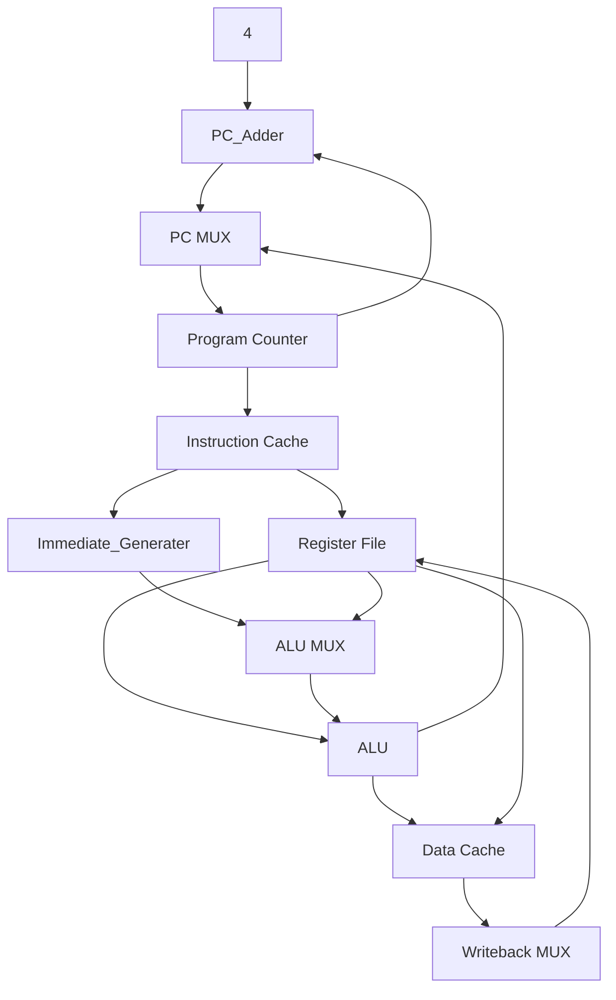

# **Design and Implementation of a Single-Cycle RISC-V Processor**

This repository contains the design and Verilog implementation of a Single-Cycle RISC-V Processor supporting the **RV32I** instruction set. The design is written in Verilog and integrates all fundamental blocks of a RISC-V CPU into a single-cycle datapath.

## **Project Overview**
- **Architecture**: Single Cycle
- **Instruction Set**: RV32I
- **Implementation Language**: Verilog
- **RTL design and Simulation Tool**: Vivado Design Suite

## **Key Features**
  - Supports R, I, S, B, U, J-type instructions.
  - Implements ALU operations (ADD, SUB, AND, OR, XOR, SLL, SRL, SRA, SLT).
  - Includes instruction cache and data cache.
  - Immediate generator for all instruction formats.
  - Control Unit for instruction decoding.
  - Single-cycle execution of each instruction.

---

## **Block Diagram**



## **Modules Description**

### **1. Program Counter**

- Holds the current instruction address.
- Updates on each clock edge or reset.
```verilog
// Program Counter
Program_Counter pc(.clk(clk),.rst(rst),.pc_in(pc_wire),.pc_out(pc_out_wire));
```

### **2. Instruction Cache**
- Stores instructions.
- Provides instruction based on program counter value.
```verilog
// Instruction Cache
Instruction_Cache instr_cache(.rst(rst),.clk(clk),.read_address(pc_out_wire),.instruction_out(decode_wire));
```

### **3. Register File**
- 32 general-purpose registers.
- Supports two reads and one write per cycle.
```verilog
// Register File
Register_File reg_file(.rst(rst), .clk(clk), .RegWrite(RegWrite), .Rs1(decode_wire[19:15]), .Rs2(decode_wire[24:20]), 
                       .Rd(decode_wire[11:7]), .Write_data(WB_data_wire), .read_data1(read_data1), .read_data2(regtomux));
```

### **4. Immediate Generator**
- Extracts and sign-extends immediates from instructions.
```verilog
// Immediate Generator
Immediate_Generator imm_gen(.instruction(decode_wire),.imm_out(immgen_wire));
```

### **5. ALU Control**
- Control logic decides operation based on `funct3`, `funct7`, and `ALUOp`.
```verilog
// ALU_Control
ALU_Control alu_control(.funct3(decode_wire[14:12]),.funct7(decode_wire[31:25]),.ALUOp(ALUOp_wire),.ALUcontrol_Out(ALUcontrol_wire));
```

### **6. ALU**
- Performs arithmetic and logical operations.
```verilog
// ALU
ALU alu(.A(read_data1),.B(muxtoAlu),.ALUcontrol_In(ALUcontrol_wire),.Result(WB_wire),.Zero(Zero));
```


### **7. Data Cache**
- Stores and retrieves data for load/store instructions.
```verilog
// Data Memory
Data_Cache data_cache(.clk(clk),.rst(rst),.MemRead(MemRead),.MemWrite(MemWrite),.address(WB_wire),.write_data(regtomux),.read_data(read_data_wire));

```

### **8. Multiplexers**
- Used for selecting between ALU inputs, writeback data, and branch targets.

```verilog
// PC Mux
MUX_2x1 pc_mux(.input0(pc_next_wire),.input1(branch_target),.select(Branch && Zero),.out(pc_wire));
```
```verilog
// ALU Mux
MUX_2x1 alu_mux(.input0(regtomux),.input1(immgen_wire),.select(ALUSrc),.out(muxtoAlu));
```
```verilog
//WB Mux
MUX_2x1 data_cache_mux(.input0(WB_wire),.input1(read_data_wire),.select(MemToReg),.out(WB_data_wire));
```

### **9. Control Unit**
- Decodes opcode and generates control signals.
```verilog
// Control Unit
Control_Unit control_unit(.opcode(decode_wire[6:0]),.RegWrite(RegWrite),.MemRead(MemRead),.MemWrite(MemWrite),
                          .MemToReg(MemToReg),.ALUSrc(ALUSrc),.Branch(Branch),.ALUOp(ALUOp_wire));
```

### **10. Branch Adder**
- Computes target addresses for branch/jump instructions.
```verilog
//Branch_Adder
Branch_Adder branch_adder(.PC(pc_out_wire), .offset(immgen_wire), .branch_target(branch_target));
```

### **Top-Level Integration**

All modules are integrated into the **RISCV_Top** module, connecting PC, instruction fetch, decode, execute, memory, and writeback stages.

```verilog
RISCV_Top dut(.clk(clk), .rst(rst));
```

## **RTL Design**

## **Simulation**


## **Results**
- Instructions executed correctly (R, I, S, B, U, J types).
- Verified ALU, branching, load/store through simulation.

