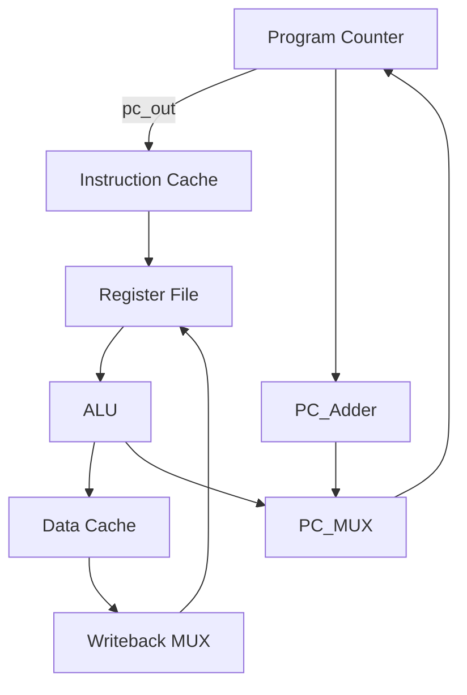

# **Design and Implementation of a Single-Cycle RISC-V Processor**

This repository contains the design and Verilog implementation of a Single-Cycle RISC-V Processor supporting the **RV32I** instruction set. The design is written in Verilog and integrates all fundamental blocks of a RISC-V CPU into a single-cycle datapath.

## **Project Overview**
- **Architecture**: Single Cycle
- **Instruction Set**: RV32I
- **Implementation Language**: Verilog
- **RTL design and Simulation Tool**: Vivado Design Suite

## **Key Features**
  - Supports R, I, S, B, U, J-type instructions.
  - Implements ALU operations (ADD, SUB, AND, OR, XOR, SLL, SRL, SRA, SLT).
  - Includes instruction cache and data cache.
  - Immediate generator for all instruction formats.
  - Control Unit for instruction decoding.
  - Single-cycle execution of each instruction.

---

## **Block Diagram**



## **Modules Description**

### **1. Program Counter**

- Holds the current instruction address.
- Updates on each clock edge or reset.
```verilog
Program_Counter pc(.clk(clk), .rst(rst), .pc_in(pc_in), .pc_out(pc_out));
```

### **2. Instruction Cache**
- Stores instructions.
- Provides instruction based on program counter value.

### **3. Register File**
- 32 general-purpose registers.
- Supports two reads and one write per cycle.

### **4. Immediate Generator**
- Extracts and sign-extends immediates from instructions.

### **5. ALU & ALU Control**
- Performs arithmetic and logical operations.
- Control logic decides operation based on `funct3`, `funct7`, and `ALUOp`.

### **6. Data Cache**
- Stores and retrieves data for load/store instructions.

### **7. Multiplexers**
- Used for selecting between ALU inputs, writeback data, and branch targets.
```verilog
MUX_2x1 mux(.input0(A), .input1(B), .select(sel), .out(Y));
```

### **8. Control Unit**
- Decodes opcode and generates control signals.

### **9. Branch Adder**
- Computes target addresses for branch/jump instructions.

### **Top-Level Integration**

All modules are integrated into the **RISCV_Top** module, connecting PC, instruction fetch, decode, execute, memory, and writeback stages.

```verilog
RISCV_Top dut(.clk(clk), .rst(rst));
```

## **Simulation**
- Test the design using any Verilog simulator.
- Example with Icarus Verilog:
```bash
iverilog -o riscv_top RISCV_Top.v testbench.v
vvp riscv_top
gtkwave dump.vcd
```

## **Results**
- Instructions executed correctly (R, I, S, B, U, J types).
- Verified ALU, branching, load/store through simulation.
(Add waveform screenshots here)
